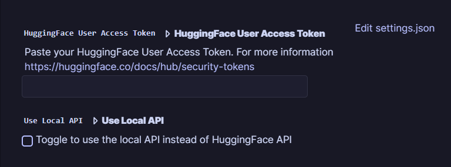

# Logseq LaTeX Formula OCR Plugin

Convert LaTeX formula images from clipboard to LaTeX code in [Logseq](https://logseq.com/) using Transformers.

**Use cases:**

- Preparation of scientific presentations or papers
- Transcribing lectures
- Technical reports
- Self-study

(For me it was useful because I hate copying formulas by hand and I hate pasting screenshots of formulas into Logseq😅)

## Commands

- `/display-formula-ocr`: Insert LaTeX code on a new line
- `/inline-formula-ocr`: Insert LaTeX code within a paragraph

> **Notes**: 
> + The image in the clipboard must be a LaTex formula image
> + Initial use may be slow due to model loading
> + With the free Hugging Face plan you can make about 30k calls per month

## Installation Options

1. **Manual + Hugging Face**
    - Requirements: [Node.js](https://nodejs.org/en), [Yarn](https://yarnpkg.com/), [Parcel](https://parceljs.org/), [Hugging Face User Access Token](https://huggingface.co/docs/hub/security-tokens)
   - Clone repo: `git clone https://github.com/olmobaldoni/logseq-formula-ocr-plugin.git`
   - Install dependencies: `cd logseq-formula-ocr-plugin && yarn && yarn build`
   - Enable developer mode: `Logseq > Settings > Advanced > Developer mode`
   - Import Plugin: `Logseq > Plugins > Load unpacked plugin` and point to the cloned repo

2. **Marketplace + Hugging Face**
   - Requirements: [Hugging Face User Access Token](https://huggingface.co/docs/hub/security-tokens)
   - Search for `LaTeX Formula OCR` in the Logseq marketplace and install directly

3. **Marketplace + Docker (Recommended)**
    - Requirements: [Docker](https://www.docker.com/)
    - Search for `LaTeX Formula OCR` in the Logseq marketplace and install directly
    - Pull image: `docker pull olmobaldoni/nougat-ocr-api:latest`
    - Run container: `docker run -d -p 80:80 olmobaldoni/nougat-ocr-api:latest`

> **Note**: For more information on how to use the local API visit: https://github.com/olmobaldoni/LaTex-Formula-OCR-API

## Settings

1. **Hugging Face**
    - In Hugging Face: `Settings > Access Tokens > New Token > Name+Role(read) > Generate a token`
    - In Logseq: `Plugins Settings > LaTex Formula OCR > Hugging Face User Access Token` and paste the token.
    
2. **Local API**
    - In Logseq: `Plugins Settings > LaTex Formula OCR > Use Local API` to switch between Hugging Face and local

## Demo

- ### Demo 1

- ### Demo 2

## Known Issues

Hugging Face API may truncate responses (see [Issuee #2](https://github.com/NormXU/nougat-latex-ocr/issues/2) and [Issue #487](https://github.com/huggingface/huggingface.js/issues/487))

> **Note**: <ins> Docker method recommended for full functionality </ins>

## Credits

This plugin is based on [nougat-latex-base](https://huggingface.co/Norm/nougat-latex-base), a fine-tuning of [facebook/nougat-base](https://huggingface.co/facebook/nougat-base) with [im2latex-100k](https://zenodo.org/records/56198#.V2px0jXT6eA), and made by [NormXU](https://github.com/NormXU).

In addition, this plugin was also inspired by [xxchan](https://github.com/xxchan) and its plugin [logseq-ocr](https://github.com/xxchan/logseq-ocr)

## License

MIT

For detailed instructions and troubleshooting, visit the [GitHub repository](https://github.com/olmobaldoni/logseq-formula-ocr-plugin).